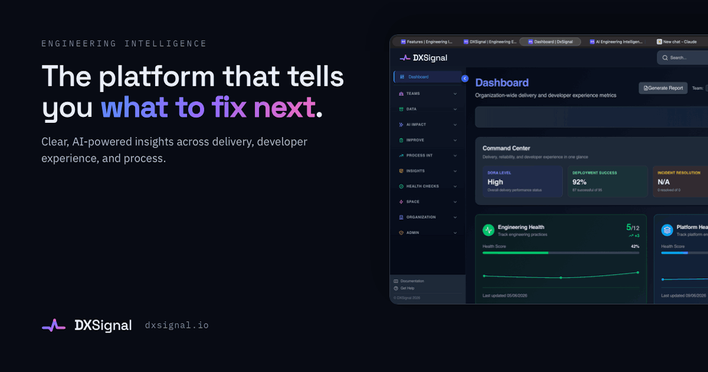

# AI Powered Engineering Intelligence Platform for modern software teams

See where your engineering org is winning, where it's stuck, and **what to fix next** — DORA metrics, DevEx, and AI-impact measurement in one platform.

[Website](https://dxsignal.io) · [Pricing](https://dxsignal.io/pricing) · [Docs](https://dxsignal.io/docs) · [Integrations](https://dxsignal.io/integrations) · [Blog](https://dxsignal.io/blog) · [Roadmap](https://dxsignal.io/roadmap)

---

## What we do

DXSignal turns the data already flowing through your toolchain into clear answers about engineering health. We go beyond a DORA dashboard:

- 📊 **DORA & delivery metrics** — deployment frequency, lead time, change failure rate, MTTR, plus PR cycle time, review depth, and build reliability.
- 🤖 **AI Impact** — measure whether your AI coding investment (Anthropic, Copilot, Cursor) is actually moving delivery, using difference-in-differences on adopting vs. non-adopting teams.
- 🧭 **DevEx & Engineering Health** — composite developer-experience scores, SPACE pulse surveys, and trends over time.
- 🎯 **What to fix next** — prioritized, explainable recommendations instead of another wall of charts.
- 📈 **Anonymized benchmarking** — see how you compare to peers with k-anonymity guarantees.

Explore the capabilities: [AI Impact](https://dxsignal.io/ai-impact) · [Benchmarking](https://dxsignal.io/benchmarking) · [Developer Experience](https://dxsignal.io/developer-experience) · [DORA Metrics](https://dxsignal.io/dora-metrics) · [Engineering Health Check](https://dxsignal.io/engineering-health-check)

## Integrations

Connect the tools you already use — no agents, no code changes:

- **Source & CI:** GitHub · GitLab · Azure DevOps · Bitbucket · Jenkins
- **Project tracking:** Jira · Linear
- **Incidents & monitoring:** PagerDuty · Datadog · Pingdom · Better Stack · UptimeRobot
- **AI usage:** Anthropic · GitHub Copilot · Cursor

Full list and setup guides → [dxsignal.io/integrations](https://dxsignal.io/integrations)

## Open source & tooling

| Repo                                                       | What it is                                                                                                    |
| ---------------------------------------------------------- | ------------------------------------------------------------------------------------------------------------- |
| [github-action](https://github.com/dxsignal/github-action) | Drop-in GitHub Action — post deployment markers, PR comments, and a health badge straight from your workflow. |

## Get started

1. [Start free](https://dxsignal.io) — connect a repo and see your metrics in minutes.
2. [Browse the docs](https://dxsignal.io/docs) to wire up integrations.
3. [Add the GitHub Action](https://github.com/dxsignal/github-action) to enrich deployment and PR signals.

## Resources

- 📚 [Documentation](https://dxsignal.io/docs)
- 🧮 [AI ROI Calculator](https://dxsignal.io/ai-roi-calculator)
- 🩺 [Engineering Health Assessment](https://dxsignal.io/engineering-health-assessment)
- 📖 [Glossary](https://dxsignal.io/glossary) · [FAQ](https://dxsignal.io/faq)
- 🔒 [Security](https://dxsignal.io/security) · [Privacy](https://dxsignal.io/privacy) · [Terms](https://dxsignal.io/terms) · [DPA](https://dxsignal.io/dpa)

## Contact

Questions, demos, or partnerships → [dxsignal.io/contact](https://dxsignal.io/contact)

---

© DXSignal — Engineering intelligence that tells you what to do, not just what happened.
